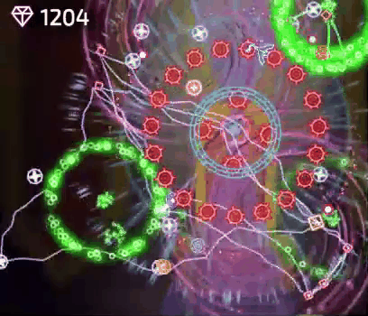
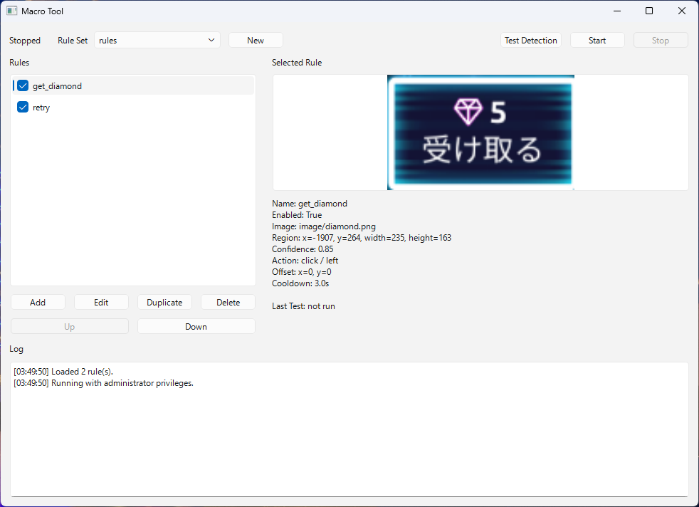
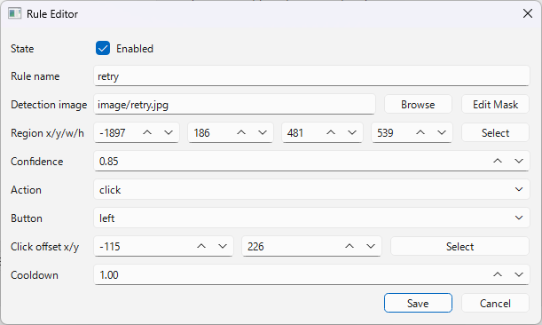
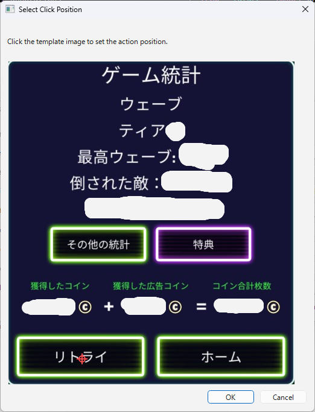
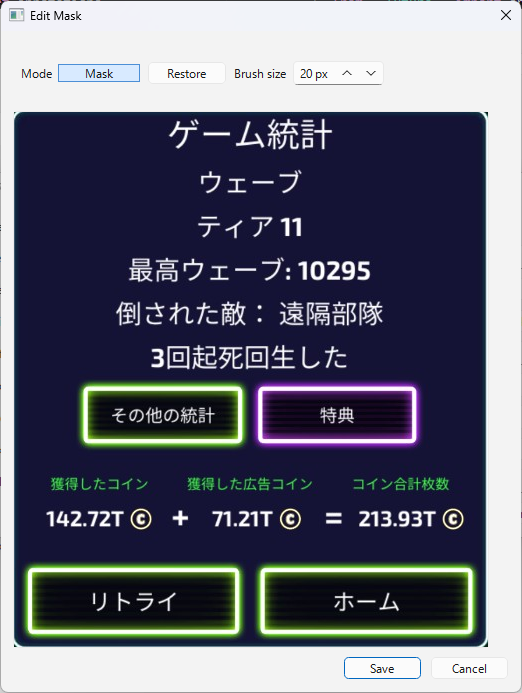
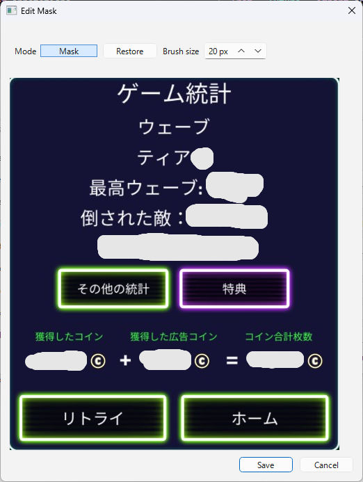
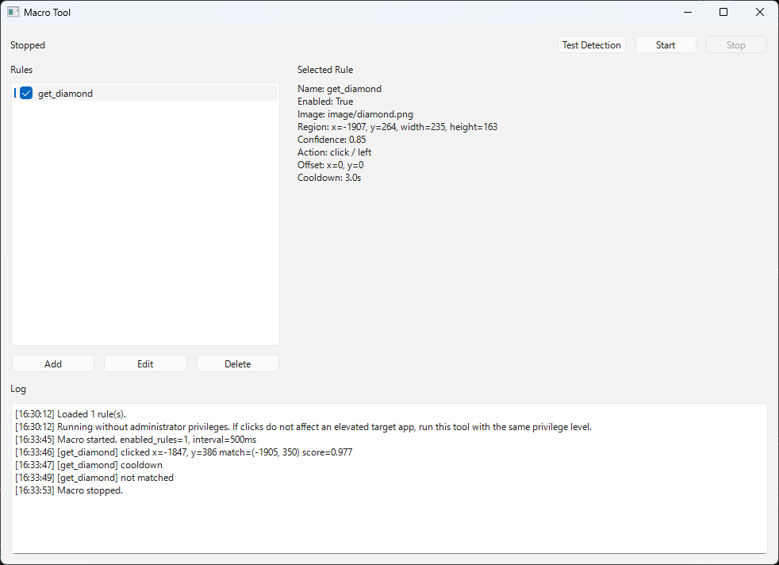

# Macro Tool

[English README](README.md)

Macro Toolは、画面内に指定画像が表示されたときにクリック操作を実行する、Python製の画像認識マクロツールです。

固定座標やdelayを並べる従来型のマクロではなく、指定した探索範囲内にテンプレート画像が現れたときにアクションを実行します。

```text
指定した探索範囲に画像が表示されたら、
検知位置をもとにクリックする
```

自分で使いやすいツールにすることと、ポートフォリオとして設計・UI・コードの分かりやすさを見せることを目的に開発しています。

## ステータス

v0.1.0を公開済みです。

現在の主な機能:

- PySide6によるデスクトップGUI
- JSONによるルール保存・読み込み
- `rules/*.json` によるルールセット切り替え
- ルールの追加・編集・削除
- ルールの複製・並び替え
- 検知画像プレビュー
- スクリーンショットからの検知画像切り出し
- 画面上での探索範囲選択
- 検知画像上でのクリック位置指定
- マルチディスプレイ対応
- `rules.json` からの相対画像パス
- OpenCVによるテンプレートマッチング
- 透過PNGによる検知除外マスク
- GUI上でのマスク編集
- 日本語ファイル名のテンプレート画像対応
- PyAutoGUIによるスクリーンショット取得とクリック実行
- cooldownによる連続クリック抑制
- クリックなしのテスト検知
- 実行ログ表示
- Windows向けexeビルド

## デモ

以下は、別アプリ上にランダムに表示される対象を検知してクリックする例です。



この映像は動作例として使用しています。Macro Tool自体は特定のゲームやアプリ専用ではなく、汎用の画像認識マクロツールです。

## スクリーンショット

メイン画面:



ルール編集:



クリック位置指定:



マスク編集:



マスク設定後の画像:



実行ログ:



## コンセプト

一般的なマクロツールでは、以下のような方式がよく使われます。

- 固定座標
- delay
- 単純なループ実行

Macro Toolでは、代わりに画像検知ベースのルールとして扱います。

- ルールごとに検知画像を設定する
- ルールごとに探索範囲を設定する
- confidenceで一致度のしきい値を設定する
- cooldownで連続発火を抑制する
- 検知できた場合にクリックする

探索範囲は誤検知防止と処理負荷軽減のため必須です。

## 技術スタック

- Python 3.11+
- PySide6
- PyAutoGUI
- OpenCV
- NumPy
- JSON
- pytest
- PyInstaller

## 使い方

依存関係をインストール:

```bash
pip install -e .[dev]
```

アプリを起動:

```bash
python -m app.main --gui
```

テストを実行:

```bash
python -m pytest
```

## Windows exeビルド

```powershell
.\scripts\build_windows.ps1
```

出力先:

```text
dist/MacroTool/MacroTool.exe
```

GitHub Releasesでは、Windows向けzipを配布しています。

## 基本操作

1. `Add`でルールを追加する。
2. ルール名を入力する。
3. 検知画像を選択する。
4. `Select`で探索範囲を選択する。
5. 必要に応じて`Edit Mask`で検知から除外する部分を透明化する。
6. Click offsetの`Select`でクリック位置を指定する。
7. confidenceとcooldownを調整する。
8. ルールを保存する。
9. `Test Detection`でクリックなしの検知確認を行う。
10. `Start`で実行する。
11. `Stop`または`Esc`で停止する。

`rules`フォルダに`xxx.json`を配置すると、メイン画面上部の`Rule Set`からルールセットを切り替えられます。

## ルール例

```json
{
  "enabled": true,
  "name": "Click item",
  "image": "image/item.png",
  "region": {
    "x": 100,
    "y": 200,
    "width": 300,
    "height": 120
  },
  "confidence": 0.85,
  "action": {
    "type": "click",
    "button": "left",
    "offset": {
      "x": 0,
      "y": 0
    }
  },
  "cooldown": 1.5
}
```

## ディレクトリ構成

```text
app/
  main.py
  models.py
  storage.py
  screenshot.py
  detector.py
  actions.py
  runner.py
  system.py
  rule_operations.py
  ui/
    main_window.py
    rule_editor.py
    region_selector.py
tests/
docs/
```

主な責務:

- `models`: ルール定義とバリデーション
- `storage`: JSON読み書き
- `screenshot`: スクリーンショット取得と仮想スクリーン原点の扱い
- `detector`: OpenCVによる画像検知
- `actions`: マウス操作
- `runner`: 実行ループとcooldown管理
- `ui`: PySide6の画面

## 設計ドキュメント

- [UI design](docs/design.md)
- [Rule schema](docs/rule_schema.md)
- [Architecture](docs/architecture.md)
- [Release notes](docs/release.md)

## 注意点

- 画像パスは可能な場合、`rules.json` からの相対パスとして保存します。
- PNG画像の透明部分は検知対象から除外されます。
- `Edit Mask`は元画像を上書きせず、別の`*.masked.png`を作成します。
- マルチディスプレイ環境では、探索範囲のx/yが負の値になることがあります。
- クリック実行後、マウスカーソルは元の位置に戻ります。
- 一部のアプリでは、シミュレートされたクリック入力が効かない場合があります。
- 信頼できないルールファイルは実行しないでください。
- 有効なルールの探索範囲がMacro Tool自身のウィンドウに重なる場合、Start前に確認ダイアログを表示します。

## 既知の制限

- 配布版はWindows向けです。
- exeは署名していないため、Windows DefenderやSmartScreenの警告が出る場合があります。
- 一部アプリでは、通常クリックと異なる扱いをされる可能性があります。
- ルールファイルはマウス操作を実行できるため、信頼できるものだけ使用してください。
- v0.1では、キーボード操作、OCR、スケジュール実行、複数アクション、条件分岐には対応していません。
- 配布版では、`rules.json` はexeの隣に保存されます。

## ライセンス

MIT Licenseです。
